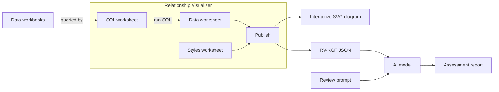

# Context Diagrams and AI Architecture Review for Relationship Visualizer

Build IT system context diagrams in Excel, export them as an **RV-KGF** JSON knowledge graph, and have an AI model write an independent architecture assessment from them.

| | |
|---|---|
| **Relationship Visualizer website** | [exceltographviz.com](https://exceltographviz.com): documentation for the Excel workbook this toolkit is built on |
| **Relationship Visualizer on GitHub** | [jjlong150/ExcelToGraphviz](https://github.com/jjlong150/ExcelToGraphviz): source code and releases |
| **RV-KGF schema** | [jjlong150/rv-kgf](https://github.com/jjlong150/rv-kgf): the knowledge graph format the toolkit exports |
| **Example assessment** | [Consumer Notifications report](examples/consumer-notifications/): a sample AI-generated architecture review |

|  |
| :---: |
| *The Consumer Notifications example. Its data was deliberately seeded with errors to test the review; see the [example](examples/consumer-notifications/) for the AI-generated assessment.* |

This toolkit extends [Relationship Visualizer](https://exceltographviz.com), a free Excel workbook that draws diagrams with Graphviz. It has three parts:

- **A data workbook** where you list actors, applications, data stores and the connections between them, along with facts about each one (data classification, PII, authentication, failure handling and more).
- **A curated style set** that turns each connection into a colored, labeled edge. Green means approved, amber means conditional or deprecated, and red means prohibited; a dashed line means a better alternative exists. Each style also carries structured properties, such as whether the protocol encrypts in transit.
- **An architecture review prompt** that reads the exported knowledge graph and produces an assessment report. The report includes a component inventory, ratings for seven architecture qualities, a risk register, and mitigations.

## How it works

Every diagram documents itself. Hovering over a node or edge in the SVG shows what it represents, and the diagram's legend shows the source workbook, author and date. The SVG supports pan, zoom and animation. The same information, plus every instance-level fact, is in the JSON knowledge graph that the AI reviews.

> [!IMPORTANT]
> This toolkit is **not** a replacement for enterprise architecture platforms such as Sparx Enterprise Architect, LeanIX, Orbus Infinity, Bizzdesign Horizzon, Avolution ABACUS or MEGA HOPEX. Those tools provide governance, repositories, impact analysis, ArchiMate/TOGAF alignment, access control and traceability far beyond what a spreadsheet can offer.
>
> It is designed for situations where:
> - budget or scale makes a full EA suite impractical;
> - teams need rapid prototyping, early-stage design discussions or a quick view of relationships;
> - speed and low overhead matter more than formal governance.
>
> It also works alongside an EA platform: the application inventory is meant to come from your EA tool's export.

## Background

Context diagrams have long been used in systems engineering and software architecture to show a system's boundary and its external interactions. This toolkit builds on that tradition and draws inspiration from the [C4 model's System Context diagram](https://c4model.com/).

It is tailored for enterprise IT. Compared with a classic context diagram, it adds:
- application types;
- data stores;
- integration paths and protocols;
- governance indicators on every connection;
- nested boundaries for trust zones and business or technical domains.

The knowledge graph export then makes the same model machine-readable, so an AI can review it.

## Ontology, semantic model and knowledge graph

The toolkit implements the three layers found in formal knowledge-graph projects, in plain Excel:

| Layer | Where it lives | What it provides |
|---|---|---|
| **Ontology** | The **Styles** worksheet, plus the **Lists** sheet's controlled vocabularies | The shared vocabulary: what kinds of things exist (actor, application and data store types), what kinds of relationships can connect them, a definition of each, and typed properties with fixed values |
| **Semantic model** | The **SQL** worksheet | The mapping from spreadsheet rows to meaning. It decides which rows become entities and which become relationships, how Via and Protocol resolve to a relationship type, and which columns become typed facts. |
| **Knowledge graph** | The **RV-KGF JSON** export | The real entities and the links you can traverse between them. It carries the ontology for the types it uses, so the file describes itself. |

The review prompt sits on top as a reasoning layer. It applies rules to the knowledge graph, using the ontology's definitions to interpret what it finds. See the [user guide](docs/user-guide.md#the-three-semantic-layers) for more.

## Quick start

> [!TIP]
> The toolkit runs inside [Relationship Visualizer](https://exceltographviz.com) **11.1 or later**, on **Windows only**. Relationship Visualizer also runs on macOS, but this toolkit reads its data through the SQL feature, which Microsoft supports only for Excel on Windows. Version 11.1 added properties on styles, which the toolkit relies on. If you haven't used Relationship Visualizer before, start with its website: it covers installing Graphviz, enabling macros, and using the ribbon and SQL worksheet.

1. **Fill in your data.** Make a copy of `Context Diagram Data.xlsx` and fill in these sheets:
   - Application Descriptions (usually from your EA tool);
   - Actors, Applications, Data Stores and Notes;
   - the three connection sheets.
2. **Open Relationship Visualizer.** Open `Relationship Visualizer.xlsm` and enable macros.
3. **Switch to the SQL worksheet.** If you're not using the default data workbook, select its folder and choose it from the list.
4. **Press Run SQL.** The diagram is displayed. Check that it looks right before going further.
5. **Open the knowledge graph.** On the **Data** ribbon tab, press **Knowledge Graph**. The JSON opens in your browser, where you can copy it or save it to a file. See [From Spreadsheet to Knowledge Graph](https://exceltographviz.com/blog/posts/knowledge-graph-export.html).
6. **Run the review.** Give the knowledge graph and the [review prompt](prompts/Architecture_Design_Review_Prompt.md) to the AI of your choice. You get an architecture assessment report back.

The [user guide](docs/user-guide.md#running-the-toolkit) explains each step in more detail.

You don't need to understand or change the SQL to use the toolkit. It reads the worksheets and builds the diagram. Change it only if you want to extend the data model.

## Repository contents

| Path | What it is |
|---|---|
| `Relationship Visualizer.xlsm` | Relationship Visualizer, preconfigured with this toolkit's Styles and SQL worksheets |
| `Context Diagram Data.xlsx` | The default data workbook: a template to copy and a worked example (Consumer Notifications) |
| `images/` | Node icons used by the styles (Tabler Icons, MIT License). Keep this folder next to the `.xlsm`, because the styles reference the icons by relative path. |
| `prompts/` | The architecture design review prompt, in Markdown and plain text |
| `docs/user-guide.md` | The full user guide: concepts, workbook reference, diagram conventions, property reference and maintenance |
| `docs/style-catalogue.md` | Every style, with its governance, properties and tooltip text (generated) |
| `source/` | Text copies of the Styles worksheet (`styles.csv`) and the SQL queries (`sql/*.sql`), so changes can be reviewed on GitHub |
| `examples/` | Worked examples. `consumer-notifications/` holds the context diagram (PDF, PNG and DOT source), the knowledge graph (pretty and minified JSON) and the AI assessment report (PDF) |

## Documentation

- **[User guide](docs/user-guide.md):** start here.
- **[Style catalogue](docs/style-catalogue.md):** look up any connection type.
- **[Review prompt](prompts/Architecture_Design_Review_Prompt.md):** what the AI is asked to do.
- **[Example assessment](examples/consumer-notifications/):** what the AI produces.
- **[Relationship Visualizer documentation](https://exceltographviz.com):** installing Graphviz, the SQL worksheet, publishing and SVG options.
- **[RV-KGF schema](https://github.com/jjlong150/rv-kgf):** the knowledge graph format.
- **[Contributing](CONTRIBUTING.md)** and **[Security](SECURITY.md)**.

## Adapting the toolkit

The governance decisions in the style set are **demonstration choices**. For example, FTP is prohibited, SOAP is deprecated, and SFTP is preferred over SCP. Adjust them to match your organization's standards; the user guide explains how in [Maintaining the style set](docs/user-guide.md#8-maintaining-the-style-set). You can also:
- add actors, applications and data stores;
- rename boundaries to reflect your own zones;
- add connection types by extending the Lists sheet and the Styles worksheet together.

## Supporting the project

This toolkit and Relationship Visualizer are free, and always will be. If they save you time, here are a few ways to help other people find them. None of them is required, and all of them are appreciated.

- ⭐ **[Leave a 5-star review on SourceForge](https://sourceforge.net/projects/relationship-visualizer/reviews/).** Even a short sentence helps search engines see that the tool is trusted and actively used.
- 🔗 **Link to [exceltographviz.com](https://exceltographviz.com) or this repository** from your blog, articles, documentation or team pages, and star the repository on GitHub. Inbound links are one of the strongest signals search engines use.
- 📣 **Mention the tool** in forums and community discussions when it's relevant.
- ☕ **[Buy me a coffee](https://buymeacoffee.com/exceltographviz).** The project still has real costs, such as hosting, domain fees and the Microsoft licenses used to build it. Contributions are entirely optional.

The [Supporting the Project](https://exceltographviz.com/pricing/#supporting-the-project) page on exceltographviz.com explains why this matters for a small independent project.

## License

This project is released under the [MIT License](LICENSE).

## Credits

Node icons are from [Tabler Icons](https://tabler.io/icons) and are used under the MIT License. See [images/README.md](images/README.md) for the full attribution.
