# User Guide

This guide explains how to model an application context diagram in a data workbook (a copy of the default **Context Diagram Data** workbook), and how each row is turned into a diagram element, a tooltip, and a fact in the JSON knowledge graph that feeds the AI architecture review.

> **Related projects:** [Relationship Visualizer website](https://exceltographviz.com) (documentation for the underlying tool) · [Relationship Visualizer on GitHub](https://github.com/jjlong150/ExcelToGraphviz) · [RV-KGF knowledge graph schema](https://github.com/jjlong150/rv-kgf)

## Contents

1. [How the toolkit fits together](#1-how-the-toolkit-fits-together), including [The three semantic layers](#the-three-semantic-layers) and [Running the toolkit](#running-the-toolkit)
2. [Two layers of information: styles and rows](#2-two-layers-of-information-styles-and-rows)
3. [Workbook reference](#3-workbook-reference), including the [data model at a glance](#data-model-at-a-glance)
4. [How rows select styles](#4-how-rows-select-styles)
5. [Reading the diagram](#5-reading-the-diagram)
6. [Style property reference](#6-style-property-reference)
7. [Style catalogue](style-catalogue.md) (separate page)
8. [Maintaining the style set](#8-maintaining-the-style-set)
9. [Known gaps and housekeeping](#9-known-gaps-and-housekeeping)

---

## 1. How the toolkit fits together

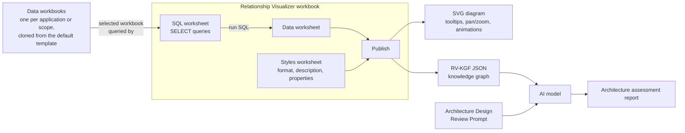

The style definitions live on the **Styles** worksheet inside the Relationship Visualizer workbook. The diagram data lives in a separate data workbook. SELECT queries on Relationship Visualizer's **SQL** worksheet pull that data into its **Data** worksheet. Publishing then combines the Data and Styles worksheets to produce the interactive SVG diagram and the RV-KGF JSON knowledge graph. The JSON is then paired with the review prompt and given to an AI model, which writes the architecture assessment report.

**One Relationship Visualizer workbook, many data workbooks.** The Context Diagram Data workbook is the default template. Clone it once for each application or scope you want to diagram and analyze. On the SQL worksheet, select the directory that holds your data workbooks, choose one from the list, and run the queries. The same styles, queries and review prompt then apply to every diagram, so results stay consistent across the portfolio.

Each style definition has three parts, and each part has a job:

| Part | Used for | Audience |
|---|---|---|
| **Format** | Colors, shapes, line styles and labels drawn by Graphviz | Anyone viewing the diagram |
| **Description** | Tooltip text in the SVG (which also supports pan/zoom and animations), style documentation, and the `description` of the style in the JSON | People hovering over the diagram and the AI reviewer |
| **Properties** | Structured facts about the style, exported to the JSON `styles` dictionary | The AI reviewer |

Only the styles that are actually used in a diagram are exported to the JSON. This keeps the file small.

### The three semantic layers

Knowledge-graph projects are usually built in three layers: an ontology, a semantic model, and the knowledge graph itself. This toolkit has all three, built in Excel.

| Layer | In this toolkit | What it does | In formal terms |
|---|---|---|---|
| **Ontology** | Styles worksheet (Relationship Visualizer), plus the Lists sheet (data workbook) | Defines the shared vocabulary. It names the kinds of entity (actor, application and data store types) and the kinds of relationship (every edge style). It gives each a definition (the description) and typed properties with fixed values. The Lists sheet adds the allowed values for instance attributes, such as Data Classification and Failure Disposition. | The schema, or *TBox*: classes, relationship types and their attributes. It is a lightweight ontology, meaning it has controlled vocabularies and definitions, but no formal logic that software could infer new facts from. |
| **Semantic model** | SQL worksheet (Relationship Visualizer) | Says how the spreadsheet data should be understood. It decides which rows are entities and which are relationships, joins Applications to Application Descriptions, resolves Via + Protocol to a relationship type, and turns columns into typed properties (including booleans). | A *mapping*: the rules that lift tabular data into graph form. Formal knowledge-graph stacks use languages such as R2RML for this job. |
| **Knowledge graph** | RV-KGF JSON export | Holds the real entities (your applications, actors and data stores) and the typed links between them, each with its own facts. | The instance data, or *ABox*. RV-KGF also embeds the ontology entries for every type it uses in its `styles` dictionary. |

Two things make this more than a naming exercise:

- **The graph describes itself.** Each export carries the definitions of every type it uses. So an AI, or any other tool, can interpret the graph correctly without separate documentation. This is why the review prompt can say "resolve each style against `styles`" and trust the result.
- **Each layer changes on its own schedule:**
  - The *ontology* changes when your architecture standards change, for example when a protocol is deprecated.
  - The *semantic model* changes when the data workbook's structure changes, for example when a column is added.
  - The *knowledge graph* is regenerated every time the SQL runs.

  Keeping them separate is what lets one ontology and one set of queries serve any number of data workbooks.

The [review prompt](../prompts/Architecture_Design_Review_Prompt.md) is a fourth, reasoning layer on top. It applies rules to the knowledge graph (for example, "any edge whose encryption is `none` must be listed as a risk"), using the ontology's definitions to interpret what it finds.

### Running the toolkit

> [!NOTE]
> **New to Relationship Visualizer?** This guide covers the toolkit's data model, styles and review, not the underlying tool. Before you start, spend some time on [exceltographviz.com](https://exceltographviz.com), which explains:
> - installing Graphviz;
> - enabling macros;
> - the ribbon, the SQL worksheet and the publishing options.
>
> The toolkit needs **Relationship Visualizer 11.1 or later**. Knowledge graph export arrived in 11.0, but only 11.1 exports the properties defined on each style, which the style set and the review prompt depend on. In 11.0, styles export only their descriptions.
>
> **Windows only.** Relationship Visualizer itself runs on Windows and macOS, but this toolkit does not work on macOS. It reads the data workbook through Relationship Visualizer's SQL feature, which depends on a Microsoft database driver that is only available for Excel on Windows. On a Mac, you can still open the published diagrams, JSON and reports.

1. **Fill in your data.** Complete a copy of the Context Diagram Data workbook, as described in [section 3](#3-workbook-reference).
2. **Open Relationship Visualizer.** Open `Relationship Visualizer.xlsm` and enable macros. See [SECURITY.md](../SECURITY.md) for what to check first.
3. **Switch to the SQL worksheet.** If your data is in a workbook other than the default, select the folder that holds it and choose it from the list.
4. **Press Run SQL.** The queries read your data workbook and fill the Data worksheet, and the diagram is displayed.

   Check the diagram before going further. It is much easier to spot problems in a picture than in JSON: a missing connection, a node in the wrong boundary, or a typo that created a duplicate node instead of matching an existing one. The AI will take the knowledge graph at face value.
5. **Open the knowledge graph.** On Relationship Visualizer's **Data** ribbon tab, press **Knowledge Graph**. The JSON opens in your browser, with a text view, a tree view and an estimate of how many tokens it will use. From there, copy it to the clipboard or save it to a file. The blog post [From Spreadsheet to Knowledge Graph](https://exceltographviz.com/blog/posts/knowledge-graph-export.html) walks through the viewer and the export in detail.
6. **Run the review.** In the AI client of your choice, paste or attach the knowledge graph together with the [review prompt](../prompts/Architecture_Design_Review_Prompt.md). The AI returns the architecture assessment report. Check your organization's policy on sharing architecture data with AI services first; see [SECURITY.md](../SECURITY.md).

To save the diagram and the knowledge graph as files together, use Relationship Visualizer's publishing controls. Tick **Graph** and **Knowledge Graph** (and **DOT** if you want the Graphviz source), then press **Publish**. All of them are produced from the same run, so they always match.

---

## 2. Two layers of information: styles and rows

Every node and edge in the knowledge graph combines two layers of information.

| Layer | Where it lives | What it describes | Example |
|---|---|---|---|
| **Style** | Styles worksheet (Relationship Visualizer) | What is always true of this *type* of component or connection | SFTP always encrypts in transit; the SFTP pattern is approved. |
| **Row (instance)** | Data workbook columns | What is true of *this specific* component or connection | This SFTP feed carries Confidential data, contains PII, and authenticates with a service account. |

The two layers are designed to be **mostly disjoint**, so the same fact is not stated in two places.

| Fact | Owned by | Why |
|---|---|---|
| Authentication | Row (`Auth Mechanism`) | Depends on how each integration is configured. |
| Data classification and PII | Row | Depends on the payload. |
| Criticality, hosting, end of support | Row (Application Descriptions) | An application's type does not determine these. |
| Encryption in transit | Style (`encryption_in_transit`) | A property of the protocol. `optional` means it depends on configuration. |
| Pattern governance | Style (`status`, `preferred_alternative`) | An architecture standard that applies to every use of the pattern. |
| Integration lifecycle | Row (`Stability`) | This specific integration may be Planned or Deprecated, whatever the pattern's status. |

**Intentional overlap.** If a row property uses the same key as a style property, the row value overrides the style default for that instance. The review prompt is instructed to call this out explicitly. `encryption_in_transit` was named so that you can add an *Encryption in Transit* column later: it would then resolve `optional` connections one by one.

> **Status vs. Stability.** A style with `status="approved"` can still have a row with Stability = *Deprecated*. That combination means the pattern is fine, but this particular integration is being retired. Both are reported; neither overrides the other.

---

## 3. Workbook reference

This section describes the default data workbook. Every clone must keep the same sheet names, column headers and named ranges, because the SQL queries depend on them.

Values in *italics* are chosen from drop-down lists maintained on the **Lists** sheet. Columns marked **Style selector** decide which style is applied. Descriptive columns become instance-level properties in the JSON. The SQL queries build each key from the column header in `snake_case` (for example, Auth Mechanism becomes `auth_mechanism`). Values are exported as they appear in the cell, with one exception: every Yes/No column (**Contains PII**, **Encryption at Rest** and **Agreements in Place**) becomes an unquoted boolean (`contains_pii=true`, `encryption_at_rest=false`, `agreements_in_place=true`). A blank cell produces no property at all.

### Data model at a glance

The diagram below shows how the sheets relate. Each connection sheet links two entity sheets by name, and each **Applications** row picks up its details from **Application Descriptions** by matching Application Title. Only the key and style-selector columns are shown; the descriptive columns are listed in the sections that follow.

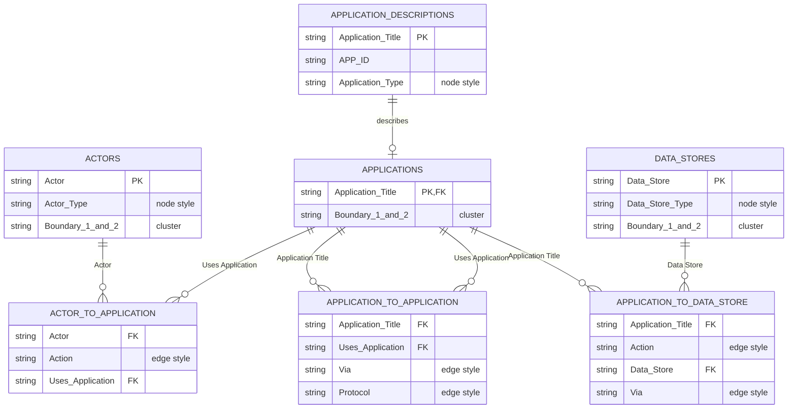

A few rules are implied by the diagram:

- **Names are the keys.** Actor, Application Title and Data Store values must be unique on their sheets, and the connection sheets refer to them by exact name. Renaming an application means changing it everywhere it appears. Drop-down lists on the connection sheets offer only names that exist.
- **Applications are a subset of the inventory.** Application Descriptions holds every application in the organization; Applications lists the ones in this diagram. An application in scope must exist in the inventory. An application in the inventory can simply be left out of scope.
- **Columns marked "node style" or "edge style" choose the style,** following the rules in [section 4](#4-how-rows-select-styles). Boundary 1 and 2 place the node in a cluster ([5.3](#53-boundaries-and-layout)).
- **Notes, Options and Lists stand alone.** Notes attach to boundaries, not to other rows. Options controls the diagram's scaffolding. Lists supplies the allowed values for the drop-downs.

### 3.1 Options

Controls the diagram's scaffolding. Each option has an **Enabled** toggle (TRUE/FALSE) and an optional **Value**. Cells shaded light blue contain formulas.

| 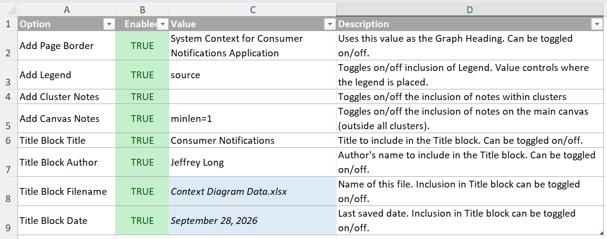 |
| :---: |

| Option | Value | Effect |
|---|---|---|
| Add Page Border | Heading text | Draws the page border (style `page_border_begin`) with this heading. |
| Add Legend | *min, max, source, sink* | Includes the legend and sets its rank position. |
| Add Cluster Notes | — | Includes notes that are assigned to a boundary. |
| Add Canvas Notes | Graphviz attributes (e.g. `minlen=1`) | Includes notes that are not assigned to any boundary. |
| Title Block Title / Author / Filename / Date | Text or formula | Populates the title block. Filename and Date are calculated. |

### 3.2 Hidden Options

Contains the **Memo Anchor** row. **Do not change or delete it.** It forces Excel's SQL driver to treat concatenated strings as Memo fields, which lifts the 255-character limit.

### 3.3 Actors

People, organizations and automated triggers that interact with applications.

| 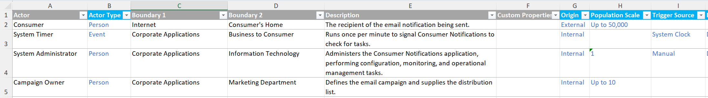 |
| :---: |

| Column | Values | Role |
|---|---|---|
| Actor | Free text | Node name |
| Actor Type | *Alarm, Bot, Event, Organization, Person, Process* | **Style selector:** node style = type in lower case (e.g. `person`) |
| Boundary 1 / Boundary 2 | Free text | Outer and inner cluster (trust zone) |
| Description | Free text | Instance description |
| Custom Properties | `key="value"` pairs | Extra instance properties |
| Origin | *Internal, External, Partner* | Instance property |
| Population Scale | *1, Up to 10, Up to 100, Up to 1,000, Up to 10,000, Up to 50,000, Up to 100,000, Up to 500,000, Up to 1,000,000, More than 1,000,000* | Instance property |
| Trigger Source | *System Clock, Message Arrival, External Webhook, Direct API Call, Data Change, Manual* | Instance property; most useful for Event, Alarm and Bot actors |
| Failure Impact | *None, Minor, Degraded, Major, Critical* | Instance property |

### 3.4 Applications

The applications that appear **in this diagram**. Descriptive details live on *Application Descriptions*.

| 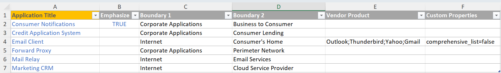 |
| :---: |

| Column | Values | Role |
|---|---|---|
| Application Title | *From Application Descriptions* | Node name. The style comes from the application's type on Application Descriptions. |
| Emphasize | TRUE | Highlights the application at the center of the diagram |
| Boundary 1 / Boundary 2 | Free text | Outer and inner cluster (trust zone) |
| Vendor Product | Free text; separate multiple values with `;` | Diagram-specific product list |
| Custom Properties | `key="value"` pairs | Extra instance properties (e.g. `comprehensive_list=false`) |

### 3.5 Application Descriptions

The organization's complete application inventory, shared by every diagram. Only applications listed on the *Applications* sheet are drawn. Application Titles must be unique.

| 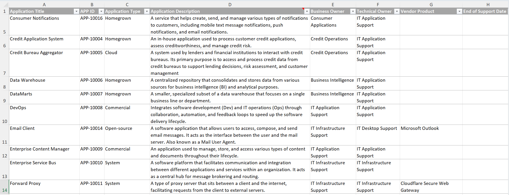 |
| :---: |

This sheet is meant to be populated from, and periodically refreshed by, an export from your Enterprise Architecture or application portfolio management tool; the toolkit consumes that inventory rather than replacing it. Treat that tool as the system of record: correct ownership, lifecycle and classification values there, then refresh this sheet. If your tool exports different column names, rename them to match the headers below; the connected approach can do this automatically in Power Query. Application Title values must match the names used on the other sheets.

**Keeping copies in sync.** Excel SQL cannot join tables across workbooks, so every data workbook carries its own copy of this sheet. Keep one master inventory, a stand-alone workbook that holds the EA tool export, and refresh the copies from it in one of two ways:

| Approach | How | Best when |
|---|---|---|
| **Copy and paste** | Paste the master list over this sheet in each data workbook before running the queries. | The inventory changes only occasionally. |
| **Connected query** | In each data workbook, use **Data → Get Data** to create a connection to the master workbook and load it into this sheet. Then use **Refresh** (or **Refresh All**) to pull a fresh copy. | The inventory is exported frequently, for example on a schedule from an EA tool. It takes more effort to set up, but each refresh takes only a click. |

Either way, the sheet name and column headers must stay the same, because the SQL queries depend on them. With the connected approach, check that the loaded table keeps the `Application_Descriptions` table name that the `AppTitles` range refers to.

| Column | Values | Role |
|---|---|---|
| Application Title | Free text | Key used by the other sheets |
| APP ID | e.g. `APP-10016` | Asset identifier |
| Application Type | *Cloud, Commercial, Homegrown, Open-source, Partner, System* | **Style selector:** node style = type in lower case (e.g. `homegrown`, `open-source`) |
| Application Description | Free text | Instance description |
| Business Owner / Technical Owner | Free text | Instance properties |
| Vendor Product | Free text | Instance property |
| Hosting Model | *Client, On Premise, IaaS, PaaS, SaaS* | Instance property |
| End of Support Date | Date or N/A | Instance property. The review flags dates that are past or within 12 months. |
| Data Classification | *Public, Internal, Confidential, Restricted* | Instance property |
| Contains PII | *Yes, No* | Instance property, exported as a boolean (`contains_pii=true` / `false`) |
| Redundancy Model | *None, Active-Active, Active-Passive, Auto-Scaling* | Instance property |
| Criticality | *Low, Medium, High, Critical* | Instance property |
| Regulatory Scope | *None, CPRA, FedRAMP, GDPR, GLBA, HIPAA, PCI-DSS, SOX, Other* | Instance property |
| Integrity / Availability / Business Continuity | *Standard, Critical* | Instance properties |

### 3.6 Data Stores

The data stores in scope for this diagram: where data is obtained from or saved to.

| 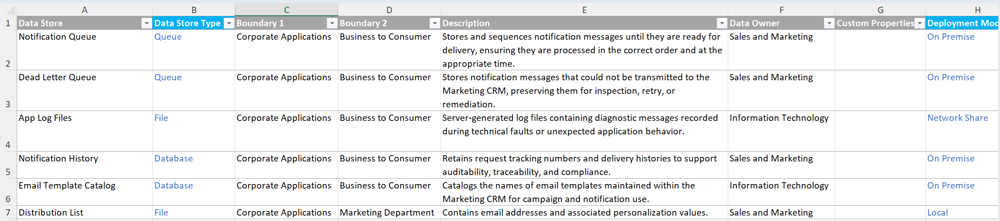 |
| :---: |

| Column | Values | Role |
|---|---|---|
| Data Store | Free text | Node name |
| Data Store Type | *Database, Directory, File, Folder, Queue, Repository* | **Style selector:** node style = type in lower case. Also determines which *Via* values are offered on Application to Data Store. |
| Boundary 1 / Boundary 2 | Free text | Outer and inner cluster |
| Description | Free text | Instance description |
| Data Owner | Free text | Instance property |
| Custom Properties | `key="value"` pairs | Extra instance properties |
| Deployment Model | Depends on type — Database, Directory, Queue and Repository: *On Premise, Cloud Self Managed, Cloud Managed Service*; File and Folder: *Local, Network Share, Cloud Storage, SAAS Platform* | Instance property |
| Data Classification | *Public, Internal, Confidential, Restricted* | Instance property |
| Contains PII | *Yes, No* | Instance property, exported as a boolean (`contains_pii=true` / `false`) |
| Data Residency | *Local Region Only, Multi Region Replicated, Sovereign Cloud Isolated, On Premise Enterprise Center, Global No Restrictions, Localized Edge Device* | Instance property |
| Retention Period | *15 Minutes, 1 Hour, 1 Day, 1 Week, 1 Month, 1 Quarter, 1 Year, 5 Years, 10 Years, Greater than 10 Years* | Instance property |
| Retry Strategy | *None, Immediate, Fixed Interval, Exponential Backoff, Circuit Breaker* | Queues only; leave blank for other types (see 3.8) |
| Failure Disposition | *Dead Letter Queue, Fallback Route, Return Error to Caller, Manual Review, Discard, Unhandled* | Queues only; leave blank for other types (see 3.8) |
| Failure Alerting | *None, Logged Only, Alert* | Queues only; leave blank for other types (see 3.8) |
| Encryption at Rest | *Yes, No* | Instance property, exported as a boolean (`encryption_at_rest=true` / `false`) |
| Backup Strategy | *None, Continuous Replication, Continuous Point in Time Recovery, Hourly Snapshots, Daily Snapshots, Weekly Backups* | Instance property |

### 3.7 Notes

Annotations drawn as note shapes (style `note`).

| 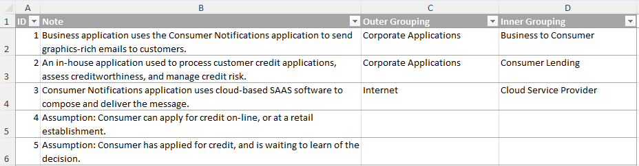 |
| :---: |

Notes with a boundary are placed in that cluster; notes without one go on the canvas. The review prompt copies note text into *Assumptions & Open Questions*; it does not treat notes as components.

| Column | Role |
|---|---|
| ID | Sequence number |
| Note | Text; phrases like "Assumption:" help the reviewer |
| Boundary 1 / Boundary 2 | Placement |
| Custom Properties | Extra properties |

### 3.8 Connection sheets — shared columns

The three connection sheets share these descriptive columns. Each becomes an instance property on the edge.

| Column | Values |
|---|---|
| Caption | Free text edge label (e.g. "Notify customer of decision") |
| Custom Properties | `key="value"` pairs |
| Data Classification | *Public, Internal, Confidential, Restricted* |
| Contains PII | *Yes, No* (exported as `contains_pii=true` / `false`) |
| Auth Mechanism | *None, Basic Auth, Password Only, Passwordless, OAuth2 or OIDC, API Key, mTLS, Cloud IAM, SAML Federation, Service Account or App ID* |
| Retry Strategy | *None, Immediate, Fixed Interval, Exponential Backoff, Circuit Breaker* |
| Failure Disposition | *Dead Letter Queue, Fallback Route, Return Error to Caller, Manual Review, Discard, Unhandled* |
| Failure Alerting | *None, Logged Only, Alert* |
| Approximate Volume | *Low, Medium, High* |

**Failure handling.** The three failure columns each answer a separate question, so fill in each one independently:

| Column | Question it answers | Notes |
|---|---|---|
| Retry Strategy | Does the caller try again, and how? | Circuit Breaker means calls stop while the target is unhealthy. |
| Failure Disposition | What happens to the request or message once retries are exhausted? | Use **Unhandled** when you know no handling exists. Leave the cell blank when you don't know; the review reports blanks as data-collection gaps. |
| Failure Alerting | Does anyone find out? | **Logged Only** means the failure is recorded but nobody is notified. |

For example, the old value *Silent Drop* is now Retry Strategy = None, Failure Disposition = Discard, Failure Alerting = None. The same three columns appear on Data Stores, but only for **queues**, and there they describe what the *broker* does with a message that keeps failing:
- Retry Strategy is the redelivery policy.
- Failure Disposition is where the message goes after the last attempt (usually Dead Letter Queue).
- Failure Alerting is whether anyone monitors the dead-letter queue.

These are separate from the values on the Enqueue and Dequeue edges, which describe how the *application* handles failure. Leave the three columns blank for databases, directories, files, folders and repositories; their failure handling belongs on the connection. Failure Impact on Actors is a different concept: it records the consequence of a failure, not how the failure is handled.

### 3.9 Actor to Application

| 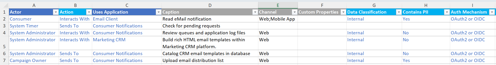 |
| :---: |

| Column | Values | Role |
|---|---|---|
| Actor | *From Actors* | Edge source |
| Action | *Gets From, Interacts With, Sends To* | **Style selector** (with the actor's type) |
| Uses Application | *From Applications* | Edge target |
| Channel | Free text; separate multiple values with `;` (e.g. `Web;Mobile App`) | Instance property: the user-facing channel |
| *Shared columns* | See 3.8 | |

### 3.10 Application to Application

| 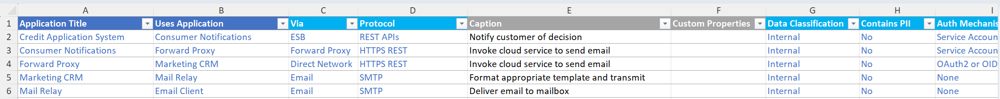 |
| :---: |

| Column | Values | Role |
|---|---|---|
| Application Title | *From Applications* | Edge source |
| Uses Application | *From Applications* | Edge target |
| Via | *API Gateway, Direct Network, Email, ESB, File Transfer, Forward Proxy, Message Broker, Reverse Proxy, Telephony* | **Style selector** (the integration path) |
| Protocol | Depends on *Via* (see [4.3](#43-application-to-application)) | **Style selector** |
| *Shared columns* | See 3.8 | |
| Agreements in Place | *Yes, No* | Instance property, exported as a boolean (`agreements_in_place=true` / `false`): contracts, SLAs or interface agreements |
| Stability | *Planned, Active Development, Stable, Deprecated* | Instance property: the lifecycle of *this* integration |

### 3.11 Application to Data Store

| 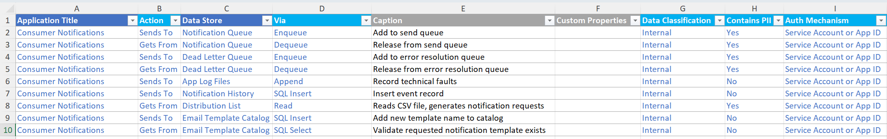 |
| :---: |

| Column | Values | Role |
|---|---|---|
| Application Title | *From Applications* | Edge source |
| Action | *Gets From, Sends To* | **Style selector** |
| Data Store | *From Data Stores* | Edge target |
| Via | Depends on the data store's type (see [4.4](#44-application-to-data-store)) | **Style selector** |
| *Shared columns* | See 3.8 | |

### 3.12 Lists

| 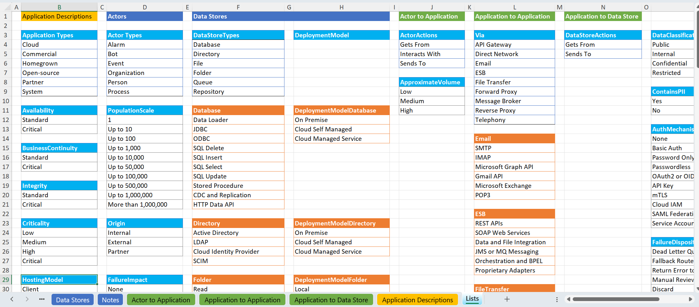 |
| :---: |

Holds every drop-down list as a named range. Protocol lists are named after their *Via* value with spaces removed (e.g. `ForwardProxy`), and the Protocol column looks them up with `INDIRECT`. To offer a new protocol, add it to the matching list **and** create the matching style ([section 8](#8-maintaining-the-style-set)).

---

## 4. How rows select styles

Style names are built from the selector columns: convert to lower case, then replace spaces and punctuation with underscores.

### 4.1 Nodes

| Sheet | Rule | Example |
|---|---|---|
| Actors | `<actor type>` | Person → `person` |
| Application Descriptions | `<application type>` | Open-source → `open-source` |
| Data Stores | `<data store type>` | Queue → `queue` |
| Notes | always `note` | |

### 4.2 Actor to Application

`<actor type>_<action>` — for example, a *System Timer* (Event) that *Sends To* an application uses `event_sends_to`.

### 4.3 Application to Application

`<via>_<protocol>` — for example, Via *Forward Proxy* + Protocol *HTTPS REST* uses `forward_proxy_https_rest`.

| Via | Protocols offered |
|---|---|
| API Gateway | HTTPS REST, GraphQL, gRPC and HTTP2, WebSocket, HTTPS SOAP, Webhooks and SSE |
| Direct Network | HTTPS REST, HTTPS SOAP, GraphQL, gRPC, Raw TCP UDP, Service Mesh mTLS |
| Email | SMTP, IMAP, Microsoft Graph API, Gmail API, Microsoft Exchange, POP3 |
| ESB | REST APIs, SOAP Web Services, Data and File Integration, JMS or MQ Messaging, Orchestration and BPEL, Proprietary Adapters |
| File Transfer | SFTP, SCP, MFT, HTTPS, FTP, Cloud Storage Buckets |
| Forward Proxy | HTTPS REST, HTTPS SOAP, gRPC and HTTP2, GraphQL, TCP or UDP Tunneling |
| Message Broker | AMQP, HTTP Webhook, JMS, Kafka Protocol, MQTT, STOMP |
| Reverse Proxy | HTTPS REST, HTTPS SOAP, gRPC and HTTP2, GraphQL, TCP or UDP Tunneling |
| Telephony | CPaaS API, CTI Dialer, PSTN Legacy, SIP Trunk, WebRTC |

### 4.4 Application to Data Store

`<action>_<via>` — for example, *Sends To* + *Enqueue* uses `sends_to_enqueue`. The *Via* values offered depend on the target data store's type:

| Data Store Type | Via values offered |
|---|---|
| Database | Data Loader, JDBC, ODBC, SQL Delete, SQL Insert, SQL Select, SQL Update, Stored Procedure, CDC and Replication, HTTP Data API |
| Directory | Active Directory, LDAP, Cloud Identity Provider, SCIM |
| File | Read, Write, Append, Execute, Delete |
| Folder | Read, Write, Append, Delete, Execute |
| Queue | Enqueue, Dequeue, Peek, Ack |
| Repository | Clone, Pull, Fetch, Commit, Push, Merge, Delete |

The File, Folder and Repository types share the file-operation styles (for example, `sends_to_delete` is used for both folders and repositories).

---

## 5. Reading the diagram

### 5.1 Nodes

Each node type gets its own icon and color, so a diagram can be read without a key. The icons are from [Tabler Icons](https://tabler.io/icons) (MIT License; see [images/README.md](../images/README.md)).

**Actors** are rounded tiles with a pastel fill.

| Icon | Actor type | Color |
|:---:|---|---|
|  | Alarm | rose |
|  | Bot | lavender |
|  | Event | green |
|  | Organization | peach |
|  | Person | blue |
|  | Process | teal |

|  |
| :---: |

**Applications** are larger tiles with a deeper color and a gradient border.

| Icon | Application type | Color |
|:---:|---|---|
|  | Cloud | blue |
|  | Commercial | red |
|  | Homegrown | orange |
|  | Open-source | green |
|  | Partner | cyan |
|  | System | grey |

| 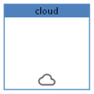 |
| :---: |

**Data stores** are drawn as an icon only, with no border.

| Icon | Data store type |
|:---:|---|
|  | Database |
|  | Directory |
|  | File |
|  | Folder |
|  | Queue |
|  | Repository |

| 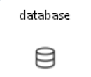 |
| :---: |

**Notes** are drawn as yellow sticky notes with an amber border.

| 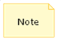 |
| :---: |

### 5.2 Edges

**Actor-to-application edges** use the actor's color, so you can trace each actor's interactions. Their color says nothing about governance.

**Application-to-application and application-to-data-store edges** use a governance color code. The color and line style always follow the style's `status` and `preferred_alternative` properties:

| Line | Meaning | Properties |
|---|---|---|
| Green, solid | Approved, no objections | `status="approved"`, no alternative |
| Green, dashed | Approved, but another pattern is preferred | `status="approved"` + `preferred_alternative` |
| Amber, solid | Allowed with conditions: requires approval, or under review | `status="requires_approval"` or `"under_review"` |
| Amber, dashed | Conditional or deprecated, and another pattern is preferred | `status="requires_approval"` or `"deprecated"` + `preferred_alternative` |
| Red, solid | Prohibited (always solid, even when an alternative is named) | `status="prohibited"` |

Each description also ends with a short governance note when the edge is not plain green (for example, *"Approved; SFTP preferred."*). The tooltip therefore explains the color.

Edge labels show the path at the tail (e.g. *API Gateway*, *Forward Proxy*, *Sends To*) and the protocol or operation at the head (e.g. *HTTPS REST*, *Enqueue*). A Caption, if present, appears as the edge's own label.

Three examples from the style set:

| Governance | Example | Style |
|---|---|---|
| Approved (green, solid) | 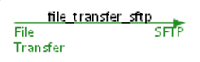 | `file_transfer_sftp` |
| Requires approval (amber, solid) |  | `forward_proxy_https_rest` |
| Prohibited (red, solid) | 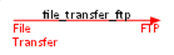 | `file_transfer_ftp` |

### 5.3 Boundaries and layout

Actors, applications, data stores and notes can be placed in up to two levels of nested clusters, using the Boundary 1 and Boundary 2 columns. Examples: "Finance Dept → Core Banking" or "Cloud → AWS Prod". Nodes with the same boundary values are drawn together; the SQL combines the node sheets with `UNION` queries to do this. The review prompt uses these clusters as trust zones, so name them after real security or hosting boundaries where you can.

| Cluster | Appearance | Example |
|---|---|---|
| Page border | Thick grey rounded border around the whole diagram, with the heading from the Options sheet. It can be switched off. | 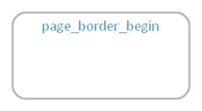 |
| Boundary 1 | Rounded cluster with a light grey fill | 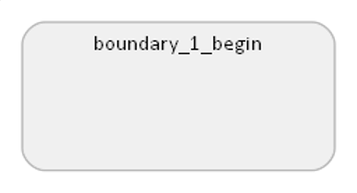 |
| Boundary 2 | Rounded cluster with a white fill, nested inside Boundary 1 | 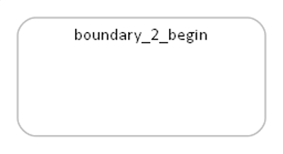 |

### 5.4 Legend

If it is enabled on the Options sheet, the diagram includes a compact legend. The legend shows the title, the colors and icons for each node type, and the source workbook, author and date. The date is when the data workbook was saved, not when the diagram was generated. Every diagram therefore documents itself when shared on its own.

| 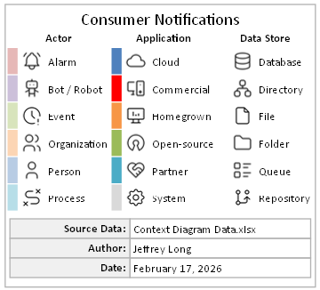 |
| :---: |

---

## 6. Style property reference

These are the keys that appear in the JSON `styles` dictionary. Values are fixed vocabularies, so rules can be applied consistently.

### 6.1 Node properties

| Key | Applies to | Values |
|---|---|---|
| `kind` | All | actor, app, datastore, annotation |
| `subtype` | All | The node type (e.g. person, homegrown, queue, note) |
| `actor_role` | Actors | human, automated, system |
| `code_ownership` | Apps | internal, vendor, community, partner, mixed |
| `operated_by` | Apps | internal, vendor, partner |
| `support_model` | Apps | internal, vendor, community, partner |
| `structure` | Data stores | structured, semi_structured, unstructured |
| `persistence` | Data stores | persistent, transient |
| `access_pattern` | Data stores | query, lookup, read_write, sequential, versioned |
| `concurrency_model` | Data stores | transactional, ordered, append_only, none |

### 6.2 Edge properties

| Key | Applies to | Values and meaning |
|---|---|---|
| `source_kind`, `target_kind` | All edges | actor, app, datastore |
| `source_subtype` | Actor edges | The actor type |
| `interaction_type` | Actor and data store edges | gets, sends, interacts — which side initiates |
| `interaction_mode` | Actor edges | consume, produce, notify, control |
| `via` | App-to-app | api_gateway, direct_network, email, esb, file_transfer, forward_proxy, message_broker, reverse_proxy, telephony |
| `operation` | Data store edges | read, write, delete, execute, consume — what happens to the data. May differ from `interaction_type` (e.g. `sends_to_sql_select` is a read). |
| `protocol_type` | System edges | Normalized protocol (rest, soap, grpc, sftp, jdbc, queue …) |
| `transport` | System edges | Network layer only: tcp, udp, tcp_udp, ssh, file_io, circuit |
| `directionality` | Actor and app-to-app edges | request_response, push, pull, push_pull, bidirectional |
| `encryption_in_transit` | System edges | **enforced** (the protocol always encrypts) · **optional** (depends on configuration, e.g. STARTTLS, LDAPS) · **none** (cleartext by design) · **not_applicable** (local file I/O) |
| `reliable_delivery`, `ordered_delivery` | App-to-app | true / false — protocol guarantees |
| `real_time`, `synchronous` | Actor and app-to-app edges | true / false |
| `status` | System edges | approved, requires_approval, under_review, deprecated, prohibited — governance of the *pattern* |
| `risk_level` | System edges | low, medium, high — inherent risk of the pattern |
| `modernity` | System edges | modern, established, legacy |
| `preferred_alternative` | Where applicable | The name of the style to use instead |

`preferred_alternative` usually names a style that is not used in the diagram, so its definition is not exported. Style names are self-describing, and the current style's description names the alternative in plain words.

---

## 7. Style catalogue

The full list of styles, with each style's governance, properties and tooltip text, is on a separate page: **[Style catalogue](style-catalogue.md)**.

---

## 8. Maintaining the style set

### 8.1 Adding a connection style

1. **Name it** by following [section 4](#4-how-rows-select-styles): `<via>_<protocol>` or `<action>_<via>`. Then add the protocol to the matching list on the Lists sheet so it appears in the drop-down.
2. **Write the description** in no more than 255 characters; most run 80–150. Say what the connection does in plain words. If it is not plain green, end with a governance note ("Requires approval.", "Deprecated; use X.", "Approved; Y preferred."). Do not describe colors or line styles.
3. **Set the properties** using the vocabularies in [section 6](#6-style-property-reference), in the same order as neighboring styles. Use only facts that are true of *every* use of the pattern. Anything that varies between integrations belongs in a row column.
4. **Set the format** from the governance table in [5.2](#52-edges): set `color` and `labelfontcolor` from `status`, and set `style=dashed` when there is a `preferred_alternative` (except for prohibited styles, which are always solid).
5. **Check the pair.** Data store styles come in *gets_from* / *sends_to* pairs. Keep their status, encryption and risk the same unless there is a reason to differ.

### 8.2 Changing a governance decision

Change `status` (and `preferred_alternative`, if needed) first, then update the format and the description's governance note to match. All three should always agree.

### 8.3 Keeping the text copies in sync

The `source/` folder holds text copies of what lives inside the Relationship Visualizer workbook: `styles.csv` (the Styles worksheet) and one `.sql` file per query on the SQL worksheet. Git can show line-by-line changes in these files, which it cannot do for `.xlsm`. Whenever you change a style or a query, update the matching file in `source/` in the same commit, then regenerate [style-catalogue.md](style-catalogue.md).

### 8.4 Adding a row-level attribute

Add the column to the relevant sheet, with a drop-down list if the values are fixed.
- **Different key:** if the fact already appears in the style properties under a different key, remove it from the styles or rename it, so the two layers don't contradict each other.
- **Same key:** if you *want* rows to override a style default, use the same key as the style property. The obvious candidate is an **Encryption in Transit** column with the values *enforced / optional / none*.

---

## 9. Known gaps and housekeeping

There are no open items. Record any new gaps here as the toolkit evolves.
